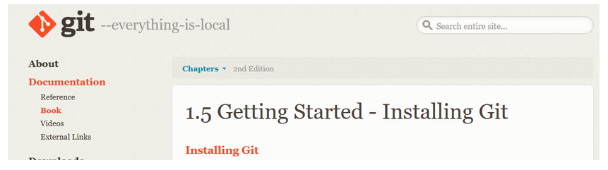
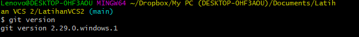
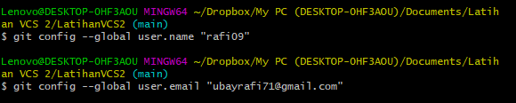

# LatihanVCS2

Repository ini dibuat untuk memenuhi tugas Pertemuan 4-Bahasa Pemrograman

**Nama : Rafi Ubaidillah**

**NIM : 312010090**

**KELAS : TI.20.A.1**

## Langkah-Langkah Penggunaan Git

* Langkah pertama Download Git,buka website resminya git : [click here](https://git-scm.com)

  

* Setelah file terdownload, silahkan lakukan instalasi dengan referensi berikut ini : *Git Installation Guide* 

  

* Setelah installasi selesai, buka software GitBash pada menu di Windows, dan lakukan pengecekan versi, dengan mengetik syntax berikut :   

` git --version`  

  

* Jika muncul tampilan git version, berarti Git sudah berhasil di install dan bisa digunakan. Langkah pertama kita harus mengkonfigurasi user nama dan email di Git, dengan mengetikkan syntax berikut :   

`git config --global user.name "masukan nama anda`"
`git config --global user.email "masukan email anda`"

  