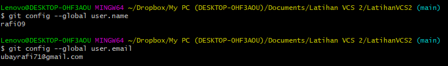

# LatihanVCS2

Repository ini dibuat untuk memenuhi tugas Pertemuan 4-Bahasa Pemrograman

**Nama : Rafi Ubaidillah**

**NIM : 312010090**

**KELAS : TI.20.A.1**

## Langkah-Langkah Penggunaan Git

* Langkah pertama Download Git,buka website resminya git : [click here](https://git-scm.com)

  

* Setelah file terdownload, silahkan lakukan instalasi dengan referensi berikut ini : *Git Installation Guide* 

  

* Setelah installasi selesai, buka software GitBash pada menu di Windows, dan lakukan pengecekan versi, dengan mengetik syntax berikut :   

`git --version`  

  

* Jika muncul tampilan git version, berarti Git sudah berhasil di install dan bisa digunakan. Langkah pertama kita harus mengkonfigurasi user nama dan email di Git, dengan mengetikkan syntax berikut :   

`git config --global user.name "masukan nama anda`"
`git config --global user.email "masukan email anda`"

  

* Setelah diisi, silahkan lakukan pengecekan user nama dan email, dengan mengetikkan perintah berikut :  

`git config --global user.name`
`git config --global user.email`  

  

* Buat akun di GitHub,seperti contoh dibawah ini.Dan lakukan Verifikasi akun melalui email yang sudah terdaftar.  

* Jika akun GitHub sudah selesai dibuat dan di verifikasi,proses selanjutnya silahkan buat Repository seperti gambar dibawah ini: Penjelasan  

    `Repository Name : (Silahkan isi nama repository yang diinginkan, seperti contoh saya ingin membuat repository LatihanVCS)`  

    `Description : (Isi dengan deskripsi atau penjelasan tentang repository Anda)`  

    `Public / Private : (PIlih salah satu jenis repository akan bisa dilihan sama semua orang atau tidak)`  

    ` Add a README.md file : Centang pada bagian ini jika Anda menginginkan file README.md ada di repository Anda`  

    `Add .gitignore : Merupakan sebuah file yang berisi daftar nama-nama file dan direktori yang akan diabaikan oleh Git.`  

    `Choose a license : Silahkan centang jika Anda memiliki lisensi pada repository yang akan dibuat Kemudian tekan tombol Create Repository untuk menyimpan`  

  

