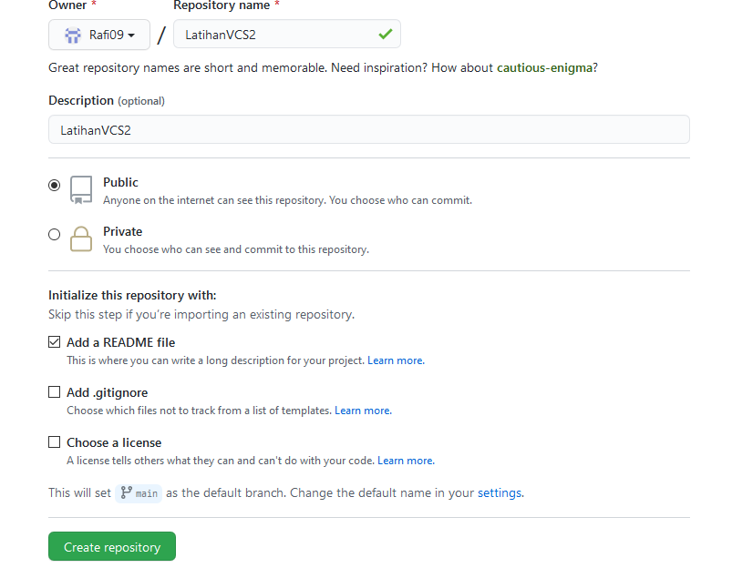
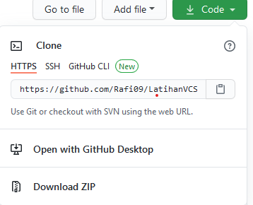
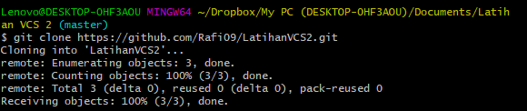
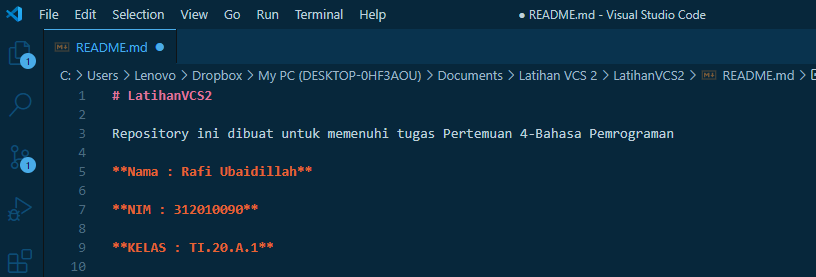
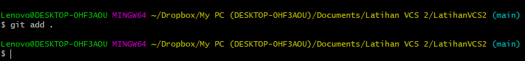

# LatihanVCS2

Repository ini dibuat untuk memenuhi tugas Pertemuan 4-Bahasa Pemrograman

**Nama : Rafi Ubaidillah**

**NIM : 312010090**

**KELAS : TI.20.A.1**

## Langkah-Langkah Penggunaan Git

* Langkah pertama Download Git,buka website resminya git : [click here](https://git-scm.com)

  

* Setelah file terdownload, silahkan lakukan instalasi dengan referensi berikut ini : *Git Installation Guide* 

  

* Setelah installasi selesai, buka software GitBash pada menu di Windows, dan lakukan pengecekan versi, dengan mengetik syntax berikut :   

`git --version`  

  

* Jika muncul tampilan git version, berarti Git sudah berhasil di install dan bisa digunakan. Langkah pertama kita harus mengkonfigurasi user nama dan email di Git, dengan mengetikkan syntax berikut :   

`git config --global user.name "masukan nama anda`"
`git config --global user.email "masukan email anda`"

  

* Setelah diisi, silahkan lakukan pengecekan user nama dan email, dengan mengetikkan perintah berikut :  

`git config --global user.name`
`git config --global user.email`  

  

* Buat akun di GitHub,seperti contoh dibawah ini.Dan lakukan Verifikasi akun melalui email yang sudah terdaftar.  

* Jika akun GitHub sudah selesai dibuat dan di verifikasi,proses selanjutnya silahkan buat Repository seperti gambar dibawah ini: Penjelasan  

    `Repository Name : (Silahkan isi nama repository yang diinginkan, seperti contoh saya ingin membuat repository LatihanVCS)`  

    `Description : (Isi dengan deskripsi atau penjelasan tentang repository Anda)`  

    `Public / Private : (PIlih salah satu jenis repository akan bisa dilihan sama semua orang atau tidak)`  

    ` Add a README.md file : Centang pada bagian ini jika Anda menginginkan file README.md ada di repository Anda`  

    `Add .gitignore : Merupakan sebuah file yang berisi daftar nama-nama file dan direktori yang akan diabaikan oleh Git.`  

    `Choose a license : Silahkan centang jika Anda memiliki lisensi pada repository yang akan dibuat Kemudian tekan tombol Create Repository untuk menyimpan`  

  

* Pembuatan akun dan repository pada Github telah selesai, saat ini akan kita lakukan untuk me-remote repository Github pada GitBash Lokal. Bagaimana caranya? Langkah pertama kita harus menyalin link URL git kita di Github, dengan cara tekan tombol Code lalu klik Copy.  

  

* Pop Up Command Prompt (CMD) akan terbuka. Pada proses ini kita akan melakukan download file repository yang tadi dibuat, dengan mengetikkan syntax berikut :  

`git clone [URL] pada contohnya, saya akan memasukan git clone`  

https://github.com/Rafi09/LatihanVCS2  

  

* Saat ini kita sudah masuk kedalam folder LatihanVCS, Silahkan edit file README.md yang ada di File Explorer. Bisa menggunakan Text Editor (Sublime Text, Notepad, Notepad++, Visual Studio Code). Edit sesuai dengan keinginan. Aturan file .md (Markdown) bisa dilihat di Link berikut ini : click here  

  

*  Setelah file README.md diedit, silahkan Simpan file tersebut dengan cara CTRL+S atau File -> Save  

* Langkah selanjutnya setelah file disimpan, kita kembali pada App Git Bash (CMD). Ketik pada Git Bash seperti berikut ini :  

`git add.`  

  

* Setelah selesai melakukan git add . langkah berikutnya kita akan melakukan commit. Fungsi commit adalah untuk menyimpan perubahan yang dilakukan, tetapi tidak ada perubahan pada remote repository. Ketik pada App Git Bash seperti berikut ini :

`git commit "Update README.md"`

  

